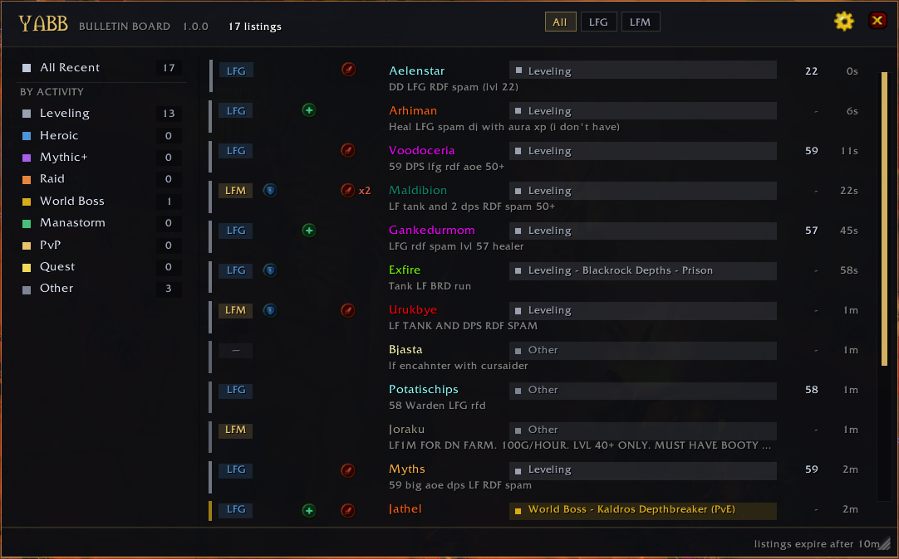

# YABB (Yet Another Bulletin Board)

A quiet LFG bulletin board for **Project Ascension** (3.3.5a). It reads the chat channels you're already in, works out which messages are group requests, and sorts them onto a board.

It never posts, whispers, broadcasts, or talks to other addons. It only reads chat, and nothing leaves your machine.

## Install

Drop the `YABB` folder into `Interface\AddOns\`, restart the client, then type `/yabb`. Enable "Load out of date AddOns" if the game flags it.

## Using it

- **Left-click** an activity in the sidebar to view only that one, **right-click** to hide it.
- **Left-click** a listing to whisper the poster, **right-click** for invite or ignore.
- The gear opens the rules editor. **Categories** are just a name, a colour, and an order. **Priority & Rules** is a list of matchers that run top to bottom — first match wins. Each matcher is a name plus some patterns, routing to a category, or *Do Nothing*, or *Hide*.
- Edits re-file listings already on the board, not just new ones. The live test box shows how any line would be classified under your current order.
- **Share config** exports your categories and rules as a string; **Import** takes one back. It carries no chat lines and no player names.

## Slash commands

| Command | |
|---|---|
| `/yabb` | Toggle the board |
| `/yabb parse <line>` | Show how one line would be classified |
| `/yabb diag` | Version and per-module init status |
| `/yabb dump` | Full diagnostic report in a copyable window — paste this into a bug report |
| `/yabb log on\|off` | Verbose classification logging |
| `/yabb capture on\|off\|clear\|dump\|status` | Record raw chat locally for tuning matchers (off by default) |
| `/yabb cache` | Player levels known this session |
| `/yabb reset` | Show what a settings reset clears; `/yabb reset confirm` does it |

## Notes

Dungeon, raid and world boss names come from the public [coa-datamine](https://github.com/srhinos/coa-datamine) dataset, so content matching is Ascension-specific. It will load on other 3.3.5a servers, but the content list won't match theirs.

No dependencies. Config sharing uses the client's LibDeflate/LibSerialize when available and falls back to a plain string when not.

## License

GPL-3.0 — see [LICENSE](LICENSE). Copyright (C) 2026 srhinos.
